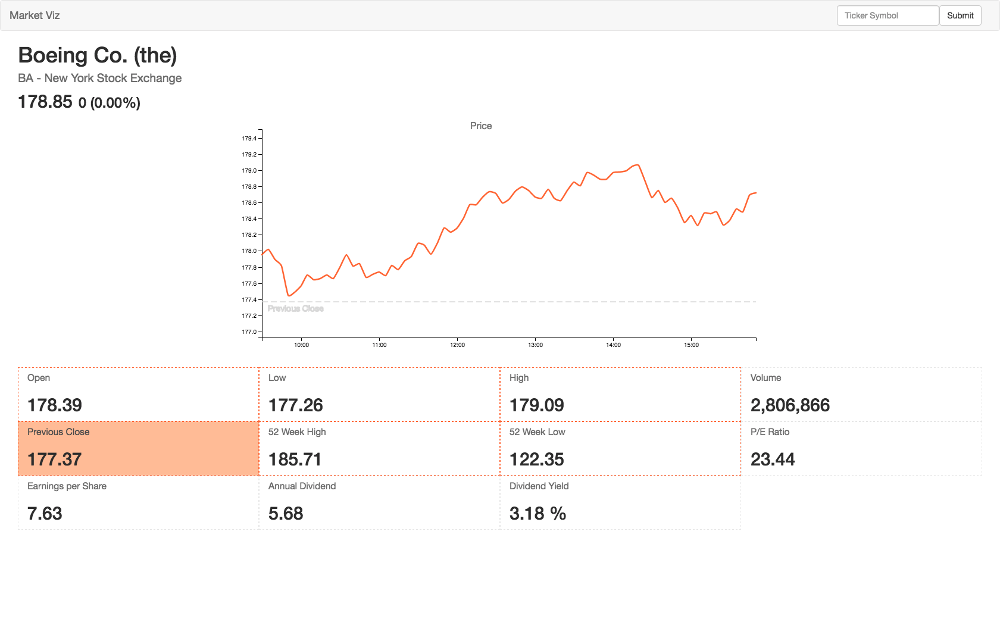

Market Viz
===

Building stock quote visualization using D3, ReactJS and Python2.

- [Django](https://www.djangoproject.com/)
- [D3](https://d3js.org)
- [ReactJS](https://facebook.github.io/react/)
- [Tradeking API](https://developers.tradeking.com)
- [Django & React](http://gregblogs.com/how-django-reactjs-and-browserify/)

### YQL (Just in Case)

YQL finance query: `select * from yahoo.finance.quotes where symbol in ("YHOO", "TSLA")`

### Other links
- http://meumobi.github.io/stocks%20apis/2016/03/13/get-realtime-stock-quotes-yahoo-finance-api.html
- [Historical Stock data](https://quantquote.com/historical-stock-data)
- [Historical Stock data docs](https://quantquote.com/docs/QuantQuote_Minute.pdf)

